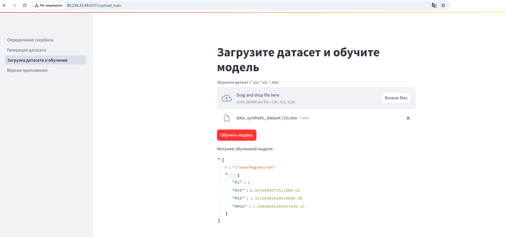

# Инструкция по использованию приложения

Приложение производит оценку технологического риска внедрения релиза с использованием математической оценки (на основании подготовленной скоринговой модели), а также с использованием предсказания обученной модели.

Оба предсказания выводятся пользователю на главной странице приложения после того, как он укажет оценку каждому критерию риска и нажмет кнопку Определить риск.

## Математическая модель оценки риска
Оценка риска внедрения математическим способом производится с использованием следующей формулы: 

$risk = Σ riskfactor * weight$, 

где 
 - $riskfactor$ – это фактор (критерий) риска, который влияет на общий риск внедрения и который требуется оценить пользователю в рамках конкретного внедрения
 - $weight$ – вес фактора риска

По итогам анализа факторов риска, была подготовлена дефолтная скоринговая карта, которая содержит следующую информацию по каждому из факторов:
- название 
- вес
- минимальное значение (целое число)
- максимально значение (целое число)
- описание 
- причины установления веса

Дефолтная скоринговая карта рисков:

Отметим, что часть факторов риска имеют прямую зависимость на общий риск – чем выше оценка, тем выше совокупный риск, другие же факторы имеют обратную зависимость, т.е. чем выше оценка, тем ниже совокупный риск. Для учета этой специфики в скоринговой карте применяется параметр direct_dependence, в котором 1 – прямая зависимость, 0 – обратная.

Таким образом, дефолтная скоринговая карта задает состав факторов риска, их веса и диапазоны значений, которые могут принимать факторы риска. После внесения пользователем оценок каждому фактору, расчет общего уровня риска производится на основании указанной выше формулы. 

### Про веса факторов риска и возможность адаптации весов скоринговой модели
Дефолтная скоринговая карта основана на нашем представлении о значимости тех или иных факторов при оценке риска внедрения (аргументы для каждого веса указаны в таблице выше). Однако мы глубоко убеждены в том, что установление весов должно осуществляться либо на основании истории внедрения релизов в конкретной компании (например, путем анализа реального датасета с историей внедрения), либо при отсутствии таких данных - экспертно сотрудником компании. Мы считаем, что в разных компаниях / командах разработки могут превалировать разные критерии в итоговой оценке риска. 

В этой связи мы представляем пользователю приложения возможность произвести настройку алгоритма «под себя», указав факторам риска те веса, которые соответствуют практике и реалиям компании. К тому же веса факторов не являются статичной величиной во времени и могут быть настроены, когда это становится необходимо. 

### Специфика настройки весов в скоринговой модели
Веса всех факторов могут быть подобраны пользователем таким образом, чтобы их сумма составляла 1. Однако это не обязательно, поскольку в любом случае производится пересчет и нормализация весов для их приведения к 1 (100%). Тем самым пользователь (эксперт), который будет настраивать скоринговую модель «под себя», может использовать ту шкалу оценки весов (значимости) факторов риска, которая удобна ему и/или принята в компании.

Настройка весов критериев производится на странице Генерация датасета. Столбец «weight» таблицы является редактируемым. При нажатии на кнопку сохранить изменения, скоркарта изменится и при определении риска алгоритмическим методом, будут использоваться новые веса. 
Пример интерфейса настройки весов модели и генерации синтетического датасета:

## Оценка риска ML моделью
Дефолтная модель оценки риска обучается на синтетическом датасете, который генерируется на основании дефолтной скоркарты в рамках автоматического pipeline сборки Docker контейнера. Однако пользователь имеет возможность загрузить собственный датасет с критериями и их оценками, а также таргетами и получить модель, обученную на собственных данных и учитывающую реальную специфику проблем внедрения компании. Следует учитывать, что столбцы датасета должны соответствовать критериям, оценка которых производится пользователем приложения.

При загрузке датасета модель проводит препроцессинг данных, нормализацию, сохраняет pipeline предобработки и после этого обучается моделью из библиотеки scikit-learn. В следующем релизе планируется реализовать обучение нескольких ML моделей с автоматическим выбором и сохранением той модели, которая показывает наилучшие метрики. 

Пример интерфейса загрузки и обучения модели:

После обучения модели, на главной странице приложения можно получить предсказание оценки риска внедрения обученной моделью.

Заметим, что при генерации синтетического датасета, оценки критериев генерируются рандомно, а для расчета таргета используется математический алгоритм, который описан выше.

Соответственно модель, обученная на таком датасете (происходит при первом запуске приложения), предсказывает оценку риска равную математическому расчету оценки риска. Это связано с тем, что в процессе обучения модель находит оптимальные веса, которые, собственно, совпадают с весами дефолтной скоркарты.

## Сценарии использования приложения
Приложение позволяет рассчитывать оценку риска внедрения математически на основании заданных весов и предсказанием модели, что позволяет подходить к оценке риска максимально гибко. Так, оценка моделью требует наличия датасета с реальными данными о релизах и имеет некоторый запаздывающий эффект во времени (за время создания датасета структура рисков и их воздействие на общий риск могли существенно измениться).

Оценка же весов экспертом позволяет более чутко и оперативно реагировать на изменение структуры рисков и их значимость. Однако минусом экспертной оценки является субъективизм конкретного эксперта. 

Таким образом, пользователь может оценить плюсы и минусы обоих подходов к оценке и выбрать тот, которые окажется более эффективным в его ситуации. Либо может усреднять обе оценки и получать оценку, которая обладает плюсами и минусами обеих систем оценки. 
